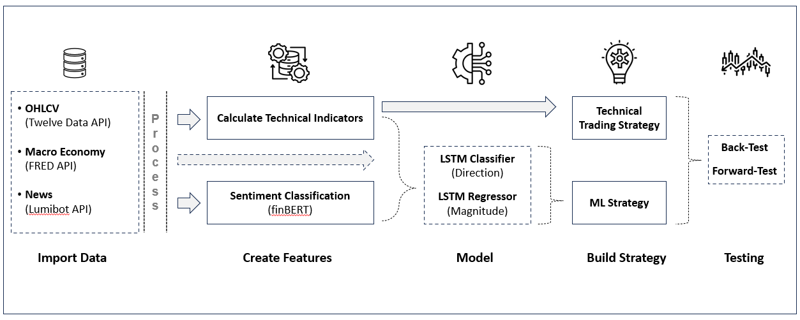

# Stock Market Prediction Platform

## Overview
This project provides a platform for predicting stock market prices and evaluating trading strategies. It combines traditional technical analysis with modern machine learning approaches, including models such as LSTM (Long Short-Term Memory) and Temporal Fusion Transformer (TFT). The platform is designed for experimentation, model development, and performance analysis in the context of financial time series forecasting and strategy backtesting.

## Features
- **Comprehensive Pipeline:** Covers data ingestion, preprocessing, model training, evaluation, and backtesting.
- **Technical and ML Strategies:** Supports both rule-based technical trading strategies and machine learning models for price prediction.
- **Multi-Task Learning:** Includes custom models for simultaneous regression (price change) and classification (direction) tasks.
- **Backtesting Tools:** Enables simulation and evaluation of trading strategies with detailed performance reports and visualizations.
- **Interactive Notebooks:** Jupyter notebooks for data exploration, model experimentation, and result analysis.
- **Modular Structure:** Codebase is organized for easy extension and maintenance.

## Skills Used
- **Python** (Pandas, PyTorch, PyTorch Forecasting, scikit-learn)
- **Deep Learning Models:** LSTM, Temporal Fusion Transformer (TFT)
- **Backtesting and Performance Analysis**

## Notes
- Sensitive information such as API keys should be stored in `secrets.json` (excluded from version control).